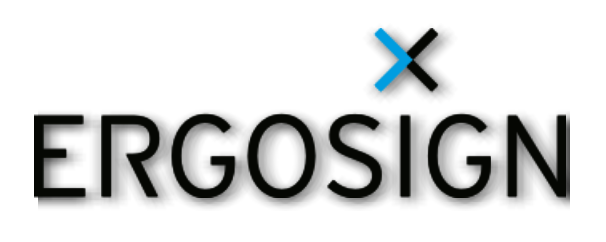

## Shader Effects



**Ergosign**  is happy to introduce the shader effects module to the open-source community. The shader effects module is a QmlPlugin. It has been created because shader effects are no longer available since Qt6.
With Qt6, the whole shader system has changed; now it is possible to write shaders not only for OpenGL, but also for vulcan, directX, metal etc. hence a new abstraction layer has been introduced. You create a fragment program and on-demand vertex program in a uniform shader language that will be translated into a qsb file. In that qsb file, Qt translates this uniform shader code in all so far available specific shader languages. Shader effects from Qt5 cannot be used in Qt6. 

Qt itself extracted a Qt Quick MultiEffect module. See: [https://www.qt.io/blog/qt-quick-multieffect](https://www.qt.io/blog/qt-quick-multieffect).
It can only be used under a commercial license for a fee.

Ergosign implemented parts of shader effects to provide the module as QmlPlugin under the MIT license. The following shaders have been implemented:

- ColorOverlayShader
- OpacityMaskShader
- ShadowShader

The ShadowShader is just an approximation of the Qt5's drop shadow. It uses a different shader algorithm because we needed drop shadows for Qt controls and images. Hence the ShadowShader is slimmed down but can be used similarly to the Qt5 drop shadow effect. The shader effects module requires Qt6 at minimum. It has been tested on IOS and Windows so far.

## Getting started

### How to build the example application
1. Open QtCreator for Qt6.
2. Open a the main CMakeLists.txt as project.
3. Configure your Qt6 compiler and destination.
4. Goto project settings and check 'BUILD_EXAMPLE' cmake variable.
5. Run CMake
6. Goto project settings and under environment set the QML2_IMPORT_PATH to ../yourBuildFolder/qml
7. Start the application.

### How to use in your project

```
git clone origin git@github.com:Ergosign/qml-shader-effects.git
mkdir build
cd build
cmake ..
make 
make install
```

Take a look at the main qml of the example application to see how the different shaders work. The color overlay shader does work exactly as the Qt5 color overlay effect. See Qt documentation for further details. The opacity mask shader does work the same as the Qt5 opacity mask effect. See Qt documentation for further details. The shadow shader is just an approximation of the Qt5's drop shader. It contains two shadows algorithms under the hood:

1. **Default**: A gaussian blur shader is used.
2. **Radial**: If set to true, a radial shadow will be created, which is suitable for round images or controls.

The following other parameters can be controlled:
- **source**: The source control, for which the shader shall be rendered.
- **horizontalOffset**: The horizontal offset translation of the shader area.
- **verticalOffset**: The vertical offset translation of the shader area.
- **blurStrength**: The strength of the shadow, the higher the value, the more blur the target control will appear. Default value is 0.5 and maximum value is 1.0.
- **transparentBorder**: See also Qt documentation.
- **cache**: Whether the shader is cached for performance reasons. This flag should only be used for controls, which are not animated. See also the Qt documentation.
- **color**: The color of the shadow.


## Support
The shader effects module can be used and extended freely without any claim to correctness and at your own risk. It would be even desired to extend the module with more shader effects or improve the shader effects by the open source community in this GitHub project. Ergosign an example application in which the shader effects are demonstrated. The project structure has been created with cmake.

## Contribute
Contribution follows the github fork pull request workflow.

## License
The animal-duck.svg has been taken from [https://freesvg.org/rubber-duck-vector-drawing](https://freesvg.org/rubber-duck-vector-drawing).
The bug and butterfly images have been taken from Qt examples page ([https://doc.qt.io/qt-5/qml-qtgraphicaleffects-opacitymask.html](https://doc.qt.io/qt-5/qml-qtgraphicaleffects-opacitymask.html)).
